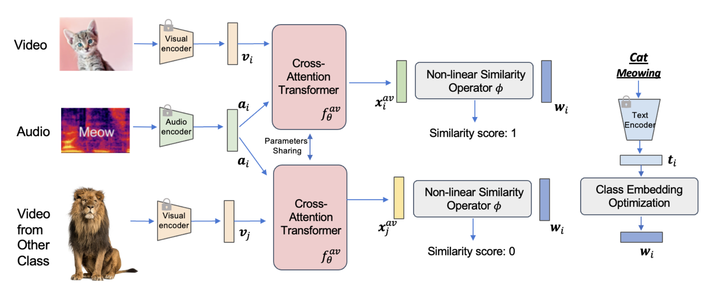

# Audio-visual Generalized Zero-shot Learning the Easy Way

We will release our code soon! 

EZ-AVGZL is a novel framework that can align audio-visual embeddings with transformed text representations for Easy Audio-Visual Generalized Zero-shot Learning, 

[**Audio-visual Generalized Zero-shot Learning the Easy Way**](https://arxiv.org/abs/2407.13095)
<br>Shentong Mo, Pedro Morgado<br>
ECCV 2024.

<div align="center">
  
</div>


## Citation

If you find this repository useful, please cite our paper:
```
@inproceedings{mo2024ezavgzl,
  title={Audio-visual Generalized Zero-shot Learning the Easy Way},
  author={Mo, Shentong and Morgado, Pedro},
  booktitle={Proceedings of European Conference on Computer Vision},
  year={2024}
}
```